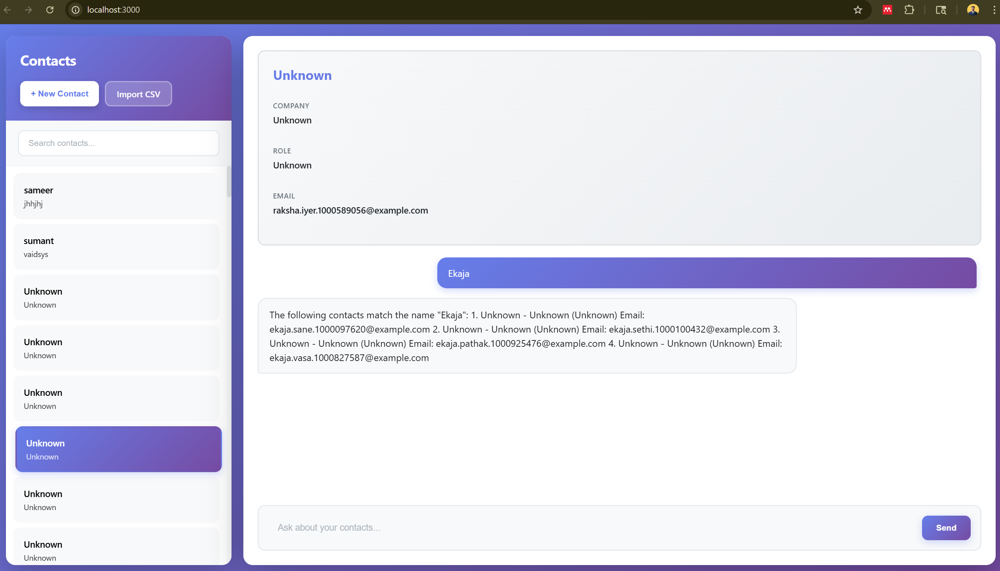

# ContactIQ - AI-Powered Contact Management & Analytics

A fullstack contact management system with AI-powered search and advanced analytics for demographic segmentation and targeted campaign planning.



*AI-powered contact search and analytics dashboard*

## Features

- ✅ Contact management (create, view, list)
- ✅ CSV import with streaming for large datasets (1K, 10K, 1M contacts)
- ✅ Arbitrary attributes support (Industry, Location, Tags, etc.)
- ✅ AI-powered chat integration with contact context
- ✅ Intelligent contact retrieval (only relevant contacts sent to AI)
- ✅ Clean, minimal UI with sidebar navigation
- ✅ Advanced analytics and demographic segmentation
- ✅ Campaign recommendations based on contact patterns

## Architecture

### Tech Stack
- **Backend**: Node.js + Express + MongoDB
- **Frontend**: React
- **AI Integration**: Google Gemini API
- **CSV Processing**: Streaming parser for memory efficiency

### Design Decisions

#### 1. Contact Data Model
```javascript
{
  name: String (required, indexed),
  company: String (indexed),
  role: String,
  email: String,
  notes: String,
  attributes: Map<String, String>, // Arbitrary key-value pairs
  createdAt: Date
}
```

**Why MongoDB Map type?**
- Flexible schema for arbitrary attributes
- No need to predefine fields
- Efficient querying and storage
- Maintains type safety

#### 2. CSV Import Strategy
- **Streaming approach**: Processes files line-by-line
- **Batch inserts**: 1000 records at a time
- **Memory efficient**: Handles 1M+ contacts without loading entire file
- **Error resilient**: Continues on individual record failures

#### 3. AI Integration Approach
**Chosen: Context Injection with Intelligent Retrieval**

Instead of sending all contacts, the system:
1. Extracts keywords from user query
2. Uses MongoDB text search to find relevant contacts
3. Falls back to regex search if text search yields no results
4. Injects only top 20 relevant contacts into AI context

**Why this approach?**
- Simple to implement and maintain
- Works reliably without complex function calling setup
- Reduces token usage significantly
- Provides good accuracy for most queries

**Alternative approaches considered:**
- Function calling: More complex, requires careful prompt engineering
- Vector embeddings: Overkill for structured data, adds latency
- Send all contacts: Exceeds token limits, expensive

#### 4. Relevance Algorithm
```javascript
1. Extract keywords (remove stop words)
2. MongoDB text search on name, company, role, notes
3. If no results, regex search across same fields
4. Limit to top 20 results
5. Inject into system prompt
```

## Setup Instructions

### Prerequisites
- Node.js 16+
- MongoDB running locally or connection string
- Google API key for Gemini

### Installation

1. Clone the repository
```bash
git clone <repo-url>
cd librechat-contacts
```

2. Install dependencies
```bash
npm run install-all
```

3. Configure environment
```bash
cp .env.example .env
# Edit .env and add your GOOGLE_API_KEY
```

4. Start MongoDB (if local)
```bash
mongod
```

5. Run the application
```bash
npm run dev
```

The app will be available at:
- Frontend: http://localhost:3000
- Backend: http://localhost:5000

### Importing Contacts

1. Click "Import CSV" in the sidebar
2. Select a CSV file (use `test-sample.csv` for testing with analytics)
3. Wait for import confirmation

**CSV Format**: Include these columns for full analytics support:
- `name` (required)
- `company`
- `role`
- `email`
- `notes`
- `Industry` (for industry segmentation)
- `Location` (for geographic analysis)

**Note**: Large imports may take a few minutes depending on file size.

## Usage Examples

### Creating a Contact
1. Click "+ New Contact"
2. Fill in the prompts
3. Contact appears in sidebar

### Asking Questions
Type natural language queries in the chat:
- "Who works at Acme Corp?"
- "List all CTOs"
- "What do we know about John Doe?"
- "Which contacts are interested in AI infrastructure?"
- "Show me contacts in San Francisco"

The AI will search your contacts and provide relevant answers.

### Analytics & Campaign Insights

**Access**: Click the "📊 Analytics" button in the sidebar (next to Import CSV)

The analytics dashboard provides:

#### Demographic Segmentation
- **By Industry**: Distribution across AI Infrastructure, Fintech, Cloud Computing, etc.
- **By Location**: Geographic clustering (San Francisco, Seattle, New York, etc.)
- **By Role**: Seniority analysis (CTOs, VPs, Managers, Engineers)
- **By Company**: Top companies in your network

#### Visual Insights
- Interactive bar charts showing percentages
- Summary statistics cards
- Pattern recognition across segments

#### Key Insights
Automatically generated recommendations such as:
- "AI Infrastructure represents 30% of your contacts - consider doubling down on AI expertise"
- "Top 3 locations: San Francisco (24%), Seattle (16%), New York (12%) - host regional events"
- "35% of contacts hold senior positions - focus on strategic partnerships"

#### Campaign Recommendations
Targeted campaign strategies including:

**Industry-Specific Campaigns**
- Campaign name and target segment
- Number of contacts to reach
- Tailored strategy (e.g., "Focus on scalability, performance benchmarks, cost optimization")
- Sample contacts from the segment

**Location-Based Campaigns**
- Regional event recommendations
- Local networking opportunities
- Geographic targeting strategies

**Role-Based Campaigns**
- Executive leadership outreach
- Technical specialist engagement
- Manager-level initiatives

**Example Campaign Output:**
```
Campaign: AI Infrastructure Outreach Campaign
Segment: AI Infrastructure
Target: 15 contacts
Strategy: Focus on scalability, performance benchmarks, and cost 
          optimization. Share case studies on AI workload management.
Sample Contacts:
  → John Doe - CTO at Acme Corp
  → Mike Johnson - Research Scientist at OpenAI
  → Sarah Chen - VP Engineering at Stripe
```

#### How to Use Analytics
1. Import contacts with Industry and Location attributes (use test-sample.csv)
2. Click "📊 Analytics" button
3. Review demographic segments and patterns
4. Read key insights for strategic recommendations
5. Select campaigns to execute
6. Customize messaging based on provided strategies

For detailed analytics documentation, see [Analytics Guide](docs/ANALYTICS_GUIDE.md)

## Design Questions

### 1. If the system needed to support 1,000,000 contacts, how would you redesign it?

**Current implementation already handles 1M contacts**, but for production scale:

**Database optimizations:**
- Add compound indexes: `{ company: 1, role: 1 }`
- Implement database sharding for horizontal scaling
- Use read replicas for query distribution
- Add caching layer (Redis) for frequent queries

**Search improvements:**
- Implement Elasticsearch for advanced full-text search
- Add vector embeddings for semantic search
- Pre-compute common query results
- Implement search result caching

**API optimizations:**
- Add pagination to all endpoints (already implemented)
- Implement GraphQL for flexible queries
- Add rate limiting and request throttling
- Use CDN for static assets

**Infrastructure:**
- Deploy on container orchestration (Kubernetes)
- Implement horizontal pod autoscaling
- Add load balancer for traffic distribution
- Use managed MongoDB service (Atlas)

### 2. How would you ensure the assistant retrieves the most relevant contacts for a query?

**Current approach:**
- Keyword extraction + MongoDB text search
- Regex fallback for partial matches
- Limit to top 20 results

**Improvements for better relevance:**

**Short-term (next iteration):**
- Add TF-IDF scoring for keyword importance
- Implement query expansion (synonyms)
- Add fuzzy matching for typos
- Weight fields differently (name > company > notes)

**Medium-term:**
- Use vector embeddings (sentence-transformers)
- Implement semantic similarity search
- Add user feedback loop (thumbs up/down)
- Learn from query patterns

**Long-term:**
- Fine-tune embedding model on contact data
- Implement hybrid search (keyword + semantic)
- Add personalization based on user history
- Use LLM to generate search queries from natural language

**Query understanding:**
- Extract entities (company names, roles, locations)
- Identify query intent (list, find, compare)
- Use LLM to reformulate ambiguous queries

### 3. What are the limitations of your current implementation?

**Search limitations:**
- Basic keyword matching may miss semantic queries
- No support for complex boolean queries
- Limited handling of typos and variations
- No ranking beyond text search score

**Scalability limitations:**
- Single MongoDB instance (no sharding)
- No caching layer
- Synchronous CSV import blocks the request
- No background job processing

**Feature limitations:**
- No contact editing or deletion
- No contact tagging or categorization
- No contact deduplication
- No export functionality
- No contact history/audit trail

**AI integration limitations:**
- Fixed 20-contact limit may miss relevant results
- No multi-turn context awareness
- No clarifying questions when query is ambiguous
- No confidence scoring for answers

**Security limitations:**
- No authentication or authorization
- No input validation/sanitization
- No rate limiting
- API keys in environment variables (should use secrets manager)

**UX limitations:**
- No real-time updates
- Basic error handling
- No loading states for long operations
- No search within contacts list
- No bulk operations

**Production readiness:**
- No logging or monitoring
- No error tracking (Sentry)
- No analytics
- No automated tests
- No CI/CD pipeline

## API Endpoints

### Contacts
- `GET /api/contacts` - List contacts (paginated)
- `GET /api/contacts/:id` - Get single contact
- `POST /api/contacts` - Create contact
- `POST /api/contacts/import` - Import CSV
- `POST /api/contacts/search` - Search contacts

### Chat
- `POST /api/chat/message` - Send message to AI

### Analytics
- `GET /api/analytics/segments` - Get demographic segmentation analysis
- `GET /api/analytics/campaigns` - Get campaign recommendations

## Project Structure

```
├── server/
│   ├── index.js              # Express server
│   ├── models/
│   │   └── Contact.js        # Mongoose model
│   └── routes/
│       ├── contacts.js       # Contact CRUD + import
│       ├── chat.js           # AI integration
│       └── analytics.js      # Analytics & segmentation
├── client/
│   ├── public/
│   ├── src/
│   │   ├── App.js            # Main React component with analytics
│   │   ├── index.js          # React entry point
│   │   └── index.css         # Styles (includes analytics UI)
│   └── package.json
├── docs/
│   ├── screenshots/          # Application screenshots
│   ├── ANALYTICS_GUIDE.md    # Comprehensive analytics documentation
│   └── ANALYTICS_SUMMARY.md  # Feature summary
├── test-sample.csv           # Sample data with Industry/Location
├── package.json
├── .env.example
└── README.md
```

## Analytics Feature Details

### What It Analyzes

The analytics engine processes your contact data to identify:

1. **Industry Patterns**: Which industries dominate your network
2. **Geographic Distribution**: Where your contacts are located
3. **Role Distribution**: Seniority levels and job functions
4. **Company Diversity**: How spread out your network is

### Insights Generated

- **Industry Concentration**: Identifies if you're specialized or diversified
- **Geographic Clusters**: Highlights opportunities for regional events
- **Seniority Analysis**: Shows your access to decision-makers
- **Network Health**: Assesses overall network composition

### Campaign Strategies by Industry

The system provides tailored strategies for each industry:

- **AI Infrastructure**: Scalability, performance, cost optimization
- **Fintech**: Security, compliance, transaction speed
- **Cloud Computing**: Multi-cloud strategies, automation
- **E-commerce**: Conversion optimization, personalization
- **Social Media**: User engagement, content moderation
- **And more...**

### API Access

You can also access analytics programmatically:

```bash
# Get demographic segments
curl http://localhost:5000/api/analytics/segments

# Get campaign recommendations
curl http://localhost:5000/api/analytics/campaigns
```

## Documentation

- **[Analytics Guide](docs/ANALYTICS_GUIDE.md)**: Comprehensive usage guide
- **[Analytics Summary](docs/ANALYTICS_SUMMARY.md)**: Technical implementation details
- **[Test Guide](test-analytics.md)**: Step-by-step testing instructions

## Future Enhancements

1. **Contact editing and deletion**
2. **Advanced search with filters**
3. **Contact tagging and categories**
4. **Export to CSV**
5. **Duplicate detection**
6. **Contact merge functionality**
7. **Activity timeline**
8. **Email integration**
9. **Authentication and multi-user support**
10. **Real-time collaboration**

## License

MIT
